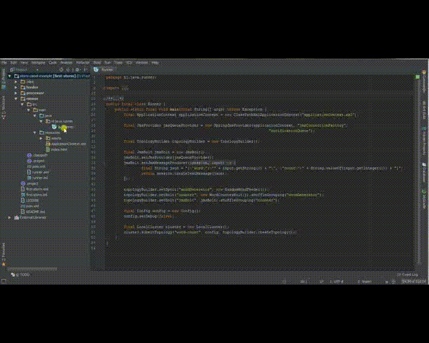

# Real-time analysis and Viz with Storm-Camel-Highcharts
----------

## You might also be interested in checking out extension of this repo for Twitter sentiment of states of US using D3.js Choropleth Map and Highcharts Columncharts on [StormTweetsSentimentD3Viz](https://github.com/P7h/StormTweetsSentimentD3Viz).

## Introduction
This repository contains an application for demonstrating Storm distributed framework by counting the names of the companies fed randomly by the code [in the Spout] in real-time. This project also visualizes the output in real-time using Queues, Websockets and Highcharts. 

[Storm](http://storm-project.net) is a free and open source distributed real-time computation system, developed at BackType by Nathan Marz and team. It has been open sourced by Twitter [post BackType acquisition] in August, 2011. 
This application has been developed and tested with Storm v0.8.2 on Windows 7 in local mode. Application may or may not work with earlier or later versions than Storm v0.8.2. 

This application has been forked and updated from Robin van Breukelen's [storm-camel-example](https://github.com/robinvanb/storm-camel-example) Project.

## Features
* Application receives a random company name from a Spout every 200 milliseconds. 
* Bolt counts frequency of the each company name passed on from the Spout. 
* This frequency is written to ActiveMQ using a JMSBolt. 
* Camel is used to read these tuples from ActiveMQ and also write to a WebSocket. 
* A pure HTML5 front-end reads from the above Websocket and visualizes the output in a Bar chart using Highcharts and updates the chart in real-time to reflect the latest count provided by the Bolt. 
* This project has also been made compatible with both Eclipse IDE and IntelliJ IDEA.
	* Import the project in your favorite IDE and you can quickly follow the code.
* As of today, this codebase has almost no or very less comments. 

## Demo

## Dependencies
* Storm v0.8.2
* Camel v2.11.0
* ActiveMQ v5.8.0
* Spring v3.2.3.RELEASE
* xbean v3.7

Also, please check [`pom.xml`](pom.xml) for complete information on the various dependencies of the project. 

## Requirements
You need the following on your machine:
* Oracle JDK >= 1.7.x
* Apache Maven >= 3.0.5
* Clone this repo and import as an existing Maven project to either Eclipse IDE or IntelliJ IDEA.
	* Please enable / download Maven Plugin in the IDE.

## Usage
To build and run this topology, you must use Java 1.7. 

### Local Mode:
Local mode can also be run on Windows environment using either IntelliJ IDEA or Eclipse IDE. *Note*: Please be sure to clean your temp folder as it adds lot of temporary files in every run.
* Launch your favorite IDE and run [`Runner.java`](runner/src/main/java/nl/java/runner/Runner.java). 
* All the required frameworks and libraries are downloaded by Maven as required in the above import process in the IDE.
	* If not, please execute `mvn clean compile` command once at the root of this repo.
* Launch a browser [preferably Google Chrome] and run [`index.html`](runner/src/main/resources/index.html) 
	* Click on "Start Viz" button to trigger the initialization. 
	* You can stop the visualization as well by clicking on "Stop Viz" button. 
* This chart updates every second and displays real-time visualization of the words processed by the Bolts. 

### Remote Mode:
TBA.

## Problems
If you find any issues, please report them either raising an [issue](https://github.com/P7h/storm-camel-example/issues) here on Github or alert me on my Twitter handle [@P7h](http://twitter.com/P7h). Or even better, please send a [pull request](https://github.com/P7h/storm-camel-example/pulls).
Appreciate your help. Thanks!

## License
Copyright &copy; 2013 Robin van Breukelen and Prashanth Babu. 
Licensed under the [Apache License, Version 2.0](http://www.apache.org/licenses/LICENSE-2.0).
